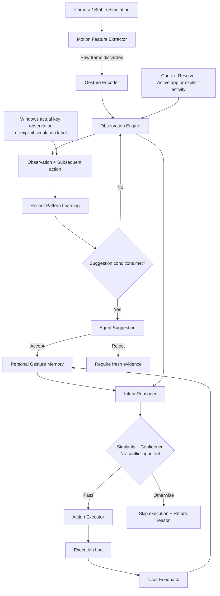

# 서비스 아키텍처

규칙은 [spec.md](../spec.md)가 소유합니다. 이 문서는 **흐름과 코드 위치**만 다룹니다.

## 1. 전체 흐름

관찰 요청의 activity를 생략하면 활성 앱에서 활동을 판정합니다. 명시적인 activity는 수동 override이며, space·device는 스냅샷 메타데이터입니다. Windows 웹캠 관측기는 같은 앱의 실제 후속 조작을 관찰 ID에 연결합니다. 시뮬레이션 UI·라벨 모드는 이 행동을 사람이 선택합니다.

실측 모션은 지속 시간·속도·진폭을 포함한 고정 특징으로 인코딩하고 최근 승자 행동 관찰의 평균과 비교합니다. 신경망이나 신원 모델을 학습하지 않습니다. 학습 모드에서는 추론을 끄고, 실행 모드에서는 승인된 기억의 유사도·점수·의도 충돌 여부를 확인합니다. 감지 오류 피드백은 매핑 신뢰도와 분리하여 유사 모션 실행을 일시 억제합니다.

제안은 최근 행동의 반복 학습 단계에서 생성하며, 거절 후에는 새 증거가 필요합니다. 동률이나 승자 변경 시 기존 자동 실행을 끕니다. 후보·실행·억제 조건은 [SPEC](../spec.md)의 L-3~L-9, M-5, I-1~I-3, F-2가 소유합니다.

## 2. 코드 위치

`backend/`는 `src/silent_orchestra/`·`tests/`·`sql/`·`scripts/`·`pyproject.toml`을 포함한다. `frontend/`는 HTML·CSS·JS이며 FastAPI가 `/`와 `/static`으로 제공한다. 아래 Python 모듈 경로는 `backend/src/silent_orchestra/` 기준이다. 공통 문서·디자인 자산·`.env`·`data/`·`run_demo.py`는 저장소 루트에 둔다.

원안의 6개 패키지(`perception/`, `context/`, `agent/`, `actions/`, `api/`, `db/`) 대신
`routers/` + `services/` 2계층입니다(결정 근거: [decision-log.md](decision-log.md) 2026-09-02).

| 단계 | 모듈 |
|---|---|
| Perception | `frontend/`(버튼 시뮬레이션), `backend/scripts/webcam_gesture_client.py`(선택) |
| Gesture Encoder | `services/gesture_encoder.py` |
| Observation + Context | `routers/agent.py` (`POST /observe`), `services/action_executor.py` (활성 창 읽기) |
| Pattern Learning | `services/pattern_learning.py` |
| Suggestion / Memory | `services/pattern_learning.py` (`respond_to_suggestion`) |
| Intent Reasoner | `services/intent_reasoner.py` |
| Action Executor | `services/action_executor.py`, 허용 Intent는 `services/action_catalog.py` |
| Feedback | `services/feedback_service.py` |
| Demo 운영 | `routers/demo.py`, `services/demo_service.py` |

공통: `models.py`(ORM), `schemas.py`(요청·응답), `config.py`(설정), `database.py`(세션).

## 3. 개인정보 처리 경계

카메라 프레임은 프로세스 메모리에서 모션 계산에만 쓰이고 디스크·네트워크로 나가지 않습니다.
`cv2.imwrite`·녹화·프레임 업로드 경로가 존재하지 않으며, DB에는 frame 경로·이미지 BLOB·얼굴 embedding
컬럼 자체가 없습니다. 규칙 전문은 [spec.md](../spec.md#입력개인정보-fr-01-fr-03-fr-14-fr-17) P-1~P-4.

실제 키 관측은 지원 앱·제어 키로 범위를 제한합니다. 합성 키는 배제하고 키 문자열 전체를 기록하지 않으며, API에는 해석된 행동만 전달합니다. OS별 지원과 허용 키는 [운영 가이드](operations.md#웹캠-학습과-실제-조작-관측)를 참고합니다.
