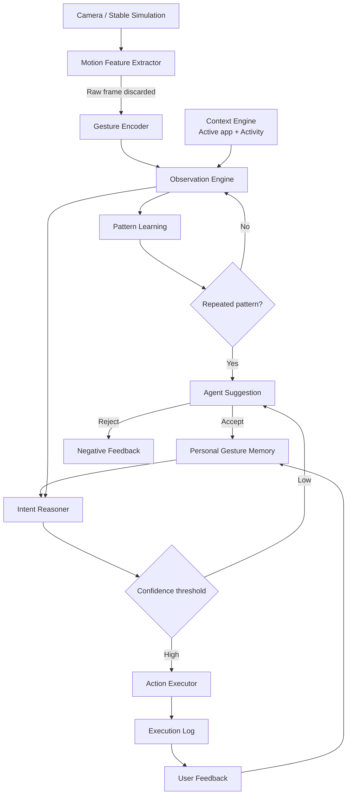

# 서비스 아키텍처

규칙은 [SPEC.md](../SPEC.md)가 소유합니다. 이 문서는 **흐름과 코드 위치**만 다룹니다.

## 1. 전체 흐름

핵심은 제스처가 곧바로 명령이 되지 않는다는 점입니다. `Gesture + Context + Personal History`가
후보 기억을 찾고, confidence가 임계값을 넘을 때만 실행되며, 결과는 피드백으로 기억에 되돌아옵니다.

## 2. 코드 위치

원안의 6개 패키지(`perception/`, `context/`, `agent/`, `actions/`, `api/`, `db/`) 대신
`routers/` + `services/` 2계층입니다(결정 근거: [decision-log.md](decision-log.md) 2026-09-02).

| 단계 | 모듈 |
|---|---|
| Perception | `static/`(버튼 시뮬레이션), `scripts/webcam_gesture_client.py`(선택) |
| Gesture Encoder | `services/gesture_encoder.py` |
| Observation + Context | `routers/agent.py` (`POST /observe`) |
| Pattern Learning | `services/pattern_learning.py` |
| Suggestion / Memory | `services/pattern_learning.py` (`respond_to_suggestion`) |
| Intent Reasoner | `services/intent_reasoner.py` |
| Action Executor | `services/action_executor.py`, 허용 Intent는 `services/action_catalog.py` |
| Feedback | `services/feedback_service.py` |
| Demo 운영 | `routers/demo.py`, `services/demo_service.py` |

공통: `models.py`(ORM), `schemas.py`(요청·응답), `config.py`(설정), `database.py`(세션).

## 3. 개인정보 처리 경계

카메라 프레임은 프로세스 메모리에서 모션 계산에만 쓰이고 디스크·네트워크로 나가지 않습니다.
`cv2.imwrite`·녹화·프레임 업로드 경로가 존재하지 않으며, DB에는 frame 경로·이미지 BLOB·얼굴 embedding
컬럼 자체가 없습니다. 규칙 전문은 [SPEC.md](../SPEC.md#입력개인정보-fr-01-fr-03-fr-14-fr-17) P-1~P-4.
