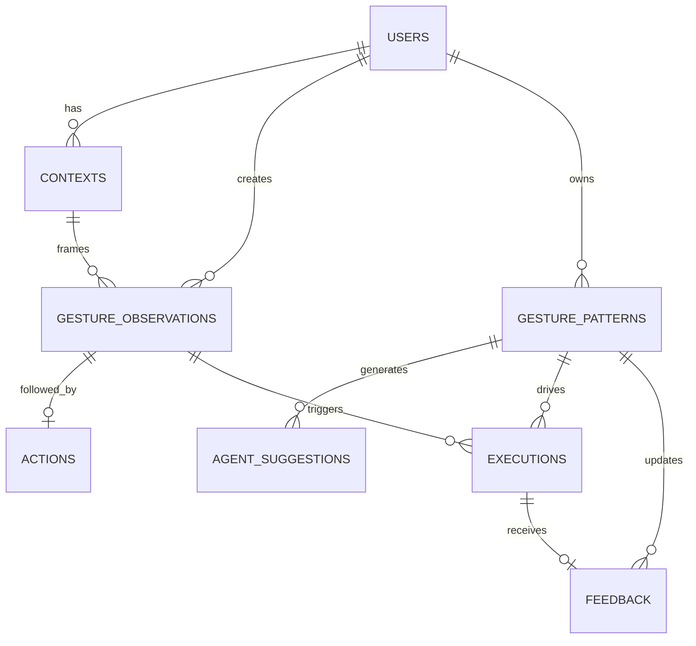

# ERD 및 데이터 설계

컬럼 정의의 출처는 [backend/sql/schema.sql](../backend/sql/schema.sql), 제약의 규범적 근거는
[spec.md](../spec.md#맥락학습-fr-02-fr-04-fr-05-fr-07)입니다.

## 1. 관계도

## 2. 테이블 역할

| 테이블 | 역할 | 핵심 보존 데이터 |
|---|---|---|
| `users` | 개인화 기억의 소유자 | 식별자, 이름 |
| `contexts` | 몸짓 발생 당시 상황(관찰마다 1건 스냅샷) | active app, activity, space, device |
| `gesture_observations` | 관찰된 원시 행동 이벤트 | embedding, motion, direction, duration |
| `actions` | 몸짓 직후 사용자가 수행한 행동 | action type, target, parameters |
| `gesture_patterns` | Personal Gesture Memory 후보·활성 기억 | intent, context scope, confidence, count |
| `agent_suggestions` | Agent가 제시한 학습 제안 | reason, confidence, status |
| `executions` | 승인된 기억의 실행 감사 로그 | intent, result, mode, error |
| `feedback` | 실행에 대한 사용자 평가 | correct, wrong, accidental, ignore |

`space`는 관찰 시점 스냅샷 값으로만 기록되고 학습 단위는 `activity`입니다.
`gesture_embedding`은 모션 특징 벡터이며 원본 영상이 아닙니다.

## 3. 인덱스

| 용도 | 인덱스 |
|---|---|
| 관찰 검색 | `(user_id, gesture_key)` |
| 기억 추론 | `(user_id, context_scope, status)` |
| 제안함 | `(user_id, status)` |
| 실행 로그 | `(user_id, executed_at)` |
| 피드백 분석 | `(gesture_pattern_id, created_at)` |

## 4. SQL 산출물

| 파일 | 내용 |
|---|---|
| `backend/sql/schema.sql` | 8개 테이블, 8개 인덱스, 제약, Personal Gesture Memory view |
| `backend/sql/seed.sql` | 맥락별 동일 제스처 샘플(설명·검증용 합성 데이터) |
| `backend/sql/queries.sql` | Memory·Suggestion·Execution·Privacy 대표 조회 |
| `backend/sql/tests.sql` | 외래키, 테이블 수, 원본 프레임 0건, 맥락 분기 assertion |
| `backend/sql/validation-report.json` | 메모리 DB 전체 실행 결과 |

검증 명령은 [README 테스트](../README.md#테스트), 실행 결과는 [TASKS 검증 기록](../tasks.md#검증-기록)에서 관리합니다.
